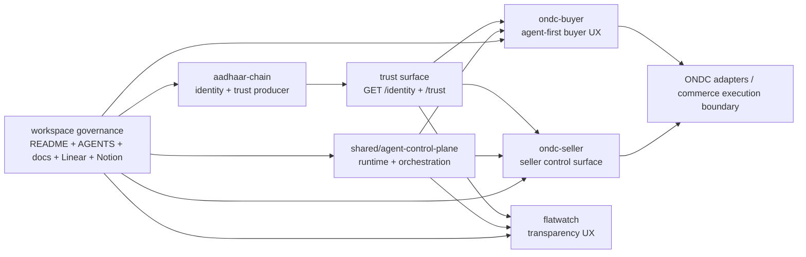

# Workspace Architecture

This is the fastest root-level entrypoint for understanding the current mission,
portfolio architecture, and operating model of this workspace.

Use this document first, then go deeper through the linked canonical docs.

## Start Here

- Mission: [docs/reference/MISSION.md](/Users/gurusharan/Documents/remote-claude/CodexWorkspace/docs/reference/MISSION.md)
- Workspace scope and guardrails: [docs/reference/WORKSPACE-SCOPE.md](/Users/gurusharan/Documents/remote-claude/CodexWorkspace/docs/reference/WORKSPACE-SCOPE.md)
- Trust consumer contract: [docs/reference/TRUST-CONSUMER-CONTRACT.md](/Users/gurusharan/Documents/remote-claude/CodexWorkspace/docs/reference/TRUST-CONSUMER-CONTRACT.md)
- Portfolio governance loop: [docs/workflow/portfolio-governance.md](/Users/gurusharan/Documents/remote-claude/CodexWorkspace/docs/workflow/portfolio-governance.md)
- Portfolio browser acceptance loop: [docs/workflow/portfolio-browser-acceptance-loop.md](/Users/gurusharan/Documents/remote-claude/CodexWorkspace/docs/workflow/portfolio-browser-acceptance-loop.md)

## Mission In One Line

Build a trustworthy portfolio around identity, commerce, and transparency, where
verification, consent, auditability, and explicit trust boundaries are first-class.

## Current Portfolio

- `aadhaar-chain`: trust substrate for identity, verification, credential handling, consent, and downstream-safe trust state
- `ondc-buyer`: agent-first buyer commerce surface with manual-route fallback
- `ondc-seller`: seller operations and catalog surface that consumes the same trust model
- `flatwatch`: transparency and audit vertical for evidence, receipts, challenges, and review flows
- `shared/agent-control-plane`: shared agent runtime and orchestration layer for portfolio apps
- workspace root: cross-repo governance, architecture guardrails, Linear/Notion/MCP operating model

## Current Architecture

## System Roles

### 1. Aadhaar Chain Is The Trust Producer

`aadhaar-chain` is not just another app. It is the single trust producer for the
portfolio.

It owns:

- identity anchor presence
- verification workflow state
- downstream-safe trust state
- consent and audit references
- revocation or block outcomes

Downstream apps consume trust state from Aadhaar Chain. They must not invent
their own trust logic when the producer already exposes the relevant state.

Canonical trust contract:
- [docs/reference/TRUST-CONSUMER-CONTRACT.md](/Users/gurusharan/Documents/remote-claude/CodexWorkspace/docs/reference/TRUST-CONSUMER-CONTRACT.md)

### 2. Shared Agent Control Plane Is The Orchestration Layer

`shared/agent-control-plane` is the cross-app runtime and orchestration layer.

Today it provides:

- runtime availability and entitlement surface
- app-scoped agent behavior
- session persistence
- buyer-domain orchestration for `ondc-buyer`
- browser-state reconciliation between agent and manual routes

Current buyer-side implementation added in this session:

- buyer-domain contracts for shopping intent, candidate offers, draft checkout, explicit final confirmation, orders, and support cases
- deterministic orchestration for:
  - `intent_parse`
  - `search_catalog`
  - `select_offer`
  - `prepare_checkout`
  - `confirm_order`
  - `get_order_status`
  - `cancel_order`
  - `create_support_case`
  - `get_support_case_status`
- session rehydration after reload so the buyer agent page restores state immediately

### 3. ONDC Buyer Is Now Agent-First

`ondc-buyer` is no longer just a buyer UI with a chat tab. The intended shape is:

- agent-first shopping flow
- deterministic commerce operations behind the agent
- explicit final confirmation before purchase
- post-order support and grievance as first-class flows
- manual UI routes remain available as fallback and review surfaces

Current state:

- agent can parse purchase intent like `buy 5 apples`
- control plane ranks deterministic candidate offers
- control plane prepares a draft checkout
- purchase submission still requires explicit confirm
- confirmed orders sync into manual orders/detail routes
- support cases can be created from both manual order detail and the agent path

This is the strongest direction for the product because the value is not a
generic storefront. The value is compressing intent, trust, and execution into
a trustworthy buyer workflow.

### 4. ONDC Seller Is A Trust-Aware Operations Surface

`ondc-seller` should be treated as a seller operations surface, not as a mirror
image of the buyer app.

Its job is:

- catalog readiness
- listing quality
- seller configuration
- order operations
- network-facing operational correctness

The seller agent path should remain tool-backed and operational, not vague
freeform chat.

### 5. FlatWatch Is The Transparency Vertical

`flatwatch` is the evidence and accountability application in the portfolio.

It uses the same trust substrate where needed, but it should not inherit
commerce-specific assumptions unless the flow genuinely depends on them.

Its core concerns are:

- evidence-backed review
- receipts
- challenges
- auditability
- role-aware operational transparency

## Protocol Boundaries

This workspace should not collapse trust, commerce, and protocol semantics into
one blurred platform story.

### ONDC

Use ONDC as the external commerce execution and network boundary.

That means:

- search and order semantics ultimately map into ONDC-facing adapters
- buyer and seller apps still own their user-facing responsibilities
- support and grievance are not optional if the buyer app is treated as a real participant

### UCP

Use UCP as an internal modeling influence and abstraction shape where it helps
agentic commerce contracts, not as a phase-one public surface.

Current working rule:

- `ONDC` is the external execution layer
- `UCP-shaped contracts` are the internal agent-facing abstraction layer

This is the course correction we reached during the session and then applied to
`ondc-buyer`.

## Best Practices Applied In This Session

These are the concrete practices that improved `ondc-buyer` and should continue
to guide architecture work here.

### Deterministic Adapter First

Do not start with a model freestyling through commerce logic.

Instead:

- define deterministic operations
- normalize outputs into domain contracts
- let the agent explain or sequence those operations

This is why buyer orchestration now uses explicit operations and structured
session state instead of generic assistant text alone.

### Explicit Final Confirmation Before Purchase

Search and recommendation can be agent-driven.

Purchase submission should remain behind an explicit confirmation checkpoint
unless a stronger authorization model is intentionally introduced later.

### Agent And Manual Routes Must Share State

Do not build one state machine for chat and another for the product UI.

This session fixed that by making buyer agent actions sync into local cart,
orders, and support-case state, and by making the agent rehydrate from browser
state after reload.

### Trust Producer Must Stay Authoritative

Trust comes from `aadhaar-chain`, not from buyer/seller-local heuristics.

Downstream apps can gate or explain actions, but they should not fork the trust
model.

### Truthful Fallbacks Beat Fake “Success”

When the full backend/runtime is not available:

- use truthful local demo mode
- keep the flow testable
- do not imply unsupported execution

That approach was essential for browser-validating buyer commerce flows end to
end without pretending a live backend existed when it did not.

### Post-Order Support Is Core, Not Polish

Tracking, cancellation, and grievance handling belong in phase one.

They are part of the user contract for a trustworthy commerce surface.

### Browser Testing Must Drive Architecture Corrections

This session exposed and fixed real issues through browser testing:

- stale post-order state after reload
- grievance parsing errors caused by loose order-id detection
- duplicate-confirm risk from a draft checkout left alive after purchase

Those were architecture and orchestration problems, not just UI bugs.

## Current ONDC Buyer Flow

The current intended buyer path is:

1. one wallet / one user identity across the portfolio
2. Aadhaar Chain provides trust state
3. buyer agent receives natural-language shopping intent
4. control plane normalizes it into a structured shopping task
5. deterministic search returns ranked candidate offers
6. agent prepares a draft checkout
7. user explicitly confirms purchase
8. order is created and synced into manual order routes
9. support and grievance can continue through either manual UI or agent

## Root-Level Doc Map

Use these root files for fast orientation:

- [README.md](/Users/gurusharan/Documents/remote-claude/CodexWorkspace/README.md): repository purpose and layout
- [MISSION.md](/Users/gurusharan/Documents/remote-claude/CodexWorkspace/MISSION.md): pointer to the canonical mission
- [ROADMAP.md](/Users/gurusharan/Documents/remote-claude/CodexWorkspace/ROADMAP.md): portfolio direction
- [AGENTS.md](/Users/gurusharan/Documents/remote-claude/CodexWorkspace/AGENTS.md): agent routing and trigger surface

## External References

Primary protocol and implementation references that should continue to shape this
workspace:

- UCP repository: [Universal-Commerce-Protocol/ucp](https://github.com/Universal-Commerce-Protocol/ucp)
- UCP documentation: [ucp.dev](https://ucp.dev/)
- ONDC official GitHub organization: [ONDC-Official](https://github.com/ONDC-Official)
- ONDC SDK repository: [ONDC-Official/ondc-sdk](https://github.com/ONDC-Official/ondc-sdk)
- ONDC log validation utility: [ONDC-Official/log-validation-utility](https://github.com/ONDC-Official/log-validation-utility)
- ONDC network policy: [resources.ondc.org/ondc-network-policy](https://resources.ondc.org/ondc-network-policy)

## Judgment

Yes, this is the right way, with one constraint:

- keep `ARCHITECTURE.md` as the fast root entrypoint
- keep stable deep-reference material in `docs/reference/*`
- keep workflows in `docs/workflow/*`
- keep `AGENTS.md` short and use it to route into the right owner docs

That gives agents and humans an immediate orientation surface without turning the
root into a duplicate documentation tree.
